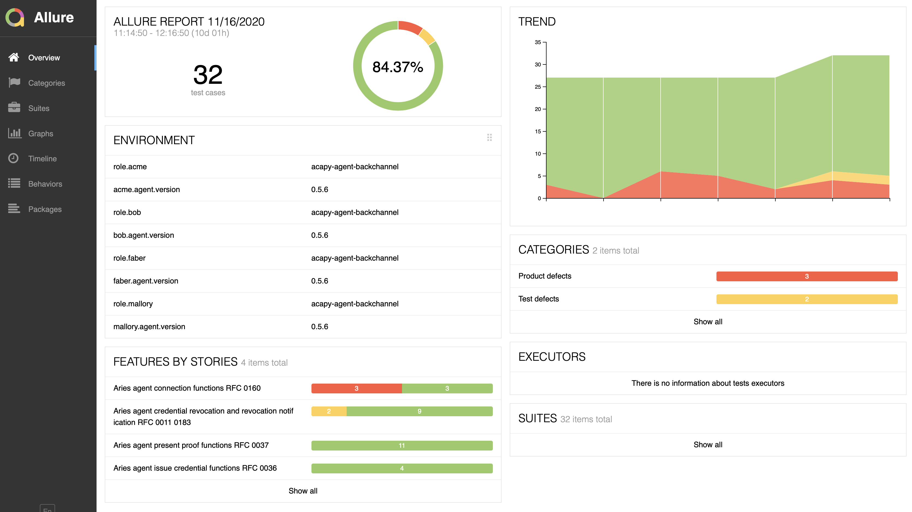

# Aries Agent Test Harness: Advanced Test Reporting 
## Contents<!-- omit in toc -->
- [Aries Agent Test Harness: Advanced Test Reporting](#aries-agent-test-harness-advanced-test-reporting)
  - [Default Reporting \& Output](#default-reporting--output)
  - [Allure Integration](#allure-integration)
    - [Using Allure with manage Script](#using-allure-with-manage-script)
    - [Using Allure at the Command Line](#using-allure-at-the-command-line)
    - [Using Allure with CI](#using-allure-with-ci)
  - [Other Reporting Options](#other-reporting-options)
    - [junit](#junit)
  - [References](#references)

## Default Reporting & Output

The Aries Agent Test Harness(AATH), in utilizing the [Behave](https://behave.readthedocs.io/en/stable/index.html) test engine, has default test output that specifically shows passed/failed steps along with a test/feature summary after an execution run. This output can of course be piped to a file as the user sees fit.  

The need will arise to give more formal and graphic reporting along with keeping historical trends of test executions under a certain configuration. The AATH integrates with the Allure Reporting framework to fulfill this requirement.  

## Allure Integration
The AATH utilizes Allure in as much as Behave and Allure integrate. See [Behave with Allure](https://docs.qameta.io/allure/#_behave) for details.

### Using Allure with manage Script
The test execution container that is ramped up with the manage script gets the Allure framework installed for use inside the continer. So to execute the tests and have Allure generated report files, use the `-r allure` option on the `manage` script.
```
cd aries-agent-test-harness
./manage run -d acapy -r allure -t @AcceptanceTest -t ~@wip
```
 Running locally and not in a build pipeline/continuous integration system, you will need to install the allure framework in order to generate and display the html report. You will also need the allure command line toolset. The brew example below is for Mac OS X, if on a different platform see the other options [here](https://docs.qameta.io/allure/#_installing_a_commandline). 
```
$ pip install allure-behave
$ brew install allure
```

To generate the html report and start an allure report server. Use any IP or port in the `open` command. 
```
cd aries-test-harness
allure generate --clean ./reports
allure open -h 192.168.2.141 -p 54236
```
If keeping  a history and reporting trends over time is important to do locally, the history folder inside the allure-report folder that was generated by Allure, will have to be copied into the reports folder before the next execution of the `allure generate` command after another test run. 
```
cd aries-test-harness
$ cp -r ./allure-report/history ./reports
allure generate --clean ./reports
```
Allure reports with the Aries Agent Test Harness will resemble the following,



### Using Allure at the Command Line
For debugging or developing purposes you may not want to always be running the test containers with the manage script, but you still may wish to maintain the reporting locally. To do that, just follow the standard command line options used with behave with custom formatters and reporters.  To run this command you will need to have Allure installed locally as above.
```
behave -f allure_behave.formatter:AllureFormatter -o ./reports -t @AcceptanceTest -t ~@wip --no-skipped -D Acme=http://0.0.0.0:8020 -D Bob=http://0.0.0.0:8030 -D Faber=http://0.0.0.0:8050
```
### Using Allure with CI
The AATH is executed with varying configurations and Aries Agent types at pre-determined intervals to make find issues and track deltas between builds of these agents. You can find the Allure reports for these test runs at the following links.

- [Acapy to Acapy Agent Interop Testing](https://allure.vonx.io/allure-docker-service-ui/projects/acapy/reports/latest)
- [Full Acapy to Acapy Agent Interop Testing](https://allure.vonx.io/allure-docker-service-ui/projects/acapy-full/reports/latest)
- [Acapy to Dotnet Agent Interop Testing](https://allure.vonx.io/allure-docker-service-ui/projects/acapy-b-dotnet/reports/latest)
- [Acapy to JavaScript Agent Interop Testing](https://allure.vonx.io/allure-docker-service-ui/projects/acapy-b-javascript/reports/latest)
- [Dotnet to Dotnet Agent Interop Testing](https://allure.vonx.io/allure-docker-service-ui/projects/dotnet/reports/latest)
- [JavaScript to JavaScript Agent Interop Testing](https://allure.vonx.io/allure-docker-service-ui/projects/javascript/reports/latest)
- [JavaScript to Dotnet Agent Interop Testing](https://allure.vonx.io/allure-docker-service-ui/projects/javascript-b-dotnet/reports/latest)
- [Acapy to AFGO Agent Interop Testing](https://allure.vonx.io/allure-docker-service-ui/projects/acapy-b-afgo/reports/latest)
- [AFGO to AFGO Agent Interop Testing](https://allure.vonx.io/allure-docker-service-ui/projects/afgo/reports/latest)

## Other Reporting Options

  
### junit
If your build pipeline is using junit style test results for reporting purposes, the AATH supports this as behave does. To use junit style report data, add the following to the behave.ini file or create your own ini file to use with behave that includes the following, 
```
[behave]
junit = true
junit_directory = ./junit-reports
```
The above junit reports cannot be used in conjunction with Allure. 
  
## References

-  [Behave formatters and reporters](https://behave.readthedocs.io/en/latest/formatters.html)

-  [Allure Framework](https://github.com/allure-framework)

-  [Allure for Python/Behave](https://github.com/allure-framework/allure-python)